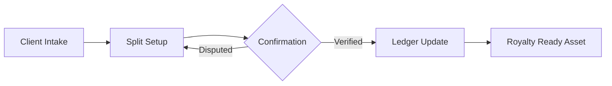

# SoundLedger Technologies Inc. — SplitSheet Platform

> **The Operational Infrastructure for Modern Music Rights.**
> *SoundLedger provides the authoritative system of record for music rights management. We eliminate royalty leakage and administrative friction by bridging the gap between creative collaboration and institutional rights accounting.*

**Repository:** [github.com/Atlas965/SplitSheet-Platform](https://github.com/Atlas965/SplitSheet-Platform)
**Current status:** MVP-ready for operator workflows and global rights infrastructure (split documentation, contributor confirmation, rights ledger, licensing readiness, royalty payouts). Not a law firm — legal review recommended before marketing as "legally binding" or "fully compliant."

---

## 📑 Executive Summary

In an era where music distribution is global and instant, rights metadata remains fragmented, manual, and prone to error. **SoundLedger Technologies Inc.** provides the "Source of Truth" for music rights. Our platform, **SplitSheet**, operates as an operator-managed B2B2C system that turns chaotic creative collaboration into structured, confirmed, and ledgered assets. By ensuring 100% split validation and maintaining an immutable audit trail, we empower producers, studios, publishers, and labels to manage their catalogs with institutional-grade precision.

### Vision: The System of Record

SplitSheet is evolving from a split-sheet documentation tool into a **global music rights operating system** — one platform spanning territory-aware rights organizations (PROs/CMOs), master vs. composition rights separation, licensing readiness scoring, and multi-party royalty settlement, without sacrificing the simplicity of the original operator-managed workflow.

---

## 🏗️ The Ecosystem Architecture

Our platform is engineered for scale, auditability, and interoperability.

| Layer | Technology Stack |
| --- | --- |
| **Frontend** | React 18, TypeScript, Wouter (routing), Tailwind CSS, Shadcn/UI + Radix |
| **Backend** | Node.js, Express.js, TypeScript, Vite (dev) + esbuild (prod bundle) |
| **Data Layer** | PostgreSQL (Neon Serverless), Drizzle ORM, `drizzle-zod` validation |
| **AI/Intelligence** | OpenAI (`gpt-4o-mini` default), SoundLedger CoPilot (SSE streaming + offline fallback) |
| **Identity/Auth** | Replit OIDC via Passport.js, RBAC multi-tenancy (Organizations) |
| **Payment/Logic** | Stripe Subscriptions (platform billing) + Stripe Connect Express (multi-party collaborator payouts), jsPDF (document generation) |

### Documentation Map

*Navigate to the section most relevant to your goals:*

* **For Strategic Partners & Enterprise:** [Vision: The System of Record](#vision-the-system-of-record) · [Organizations (Enterprise)](#organizations-tables-enterprise-multi-tenancy) · [API Reference](#8-api-reference)
* **For Operators & Studios:** [Operator Service Workflow](#4-operator-service-workflow) · [Music Agreements System](#5-music-agreements-system) · [Rights Ledger & Global Rights Framework](#6-rights-ledger--global-rights-framework)
* **For Developers:** [Architecture & Monorepo](#2-architecture) · [Running Locally](#14-running-locally) · [Launch Readiness](#17-launch-readiness)

---

## 🚀 Strategic Value Propositions

### 1. Eliminating Royalty Leakage

Royalty leakage is primarily a metadata failure. SplitSheet prevents this by:

* **Enforcing Validation:** 100% ownership totals required before proceeding.
* **Public Confirmation:** Token-based, IP-logged confirmation links for all contributors.
* **Audit-Ready:** Immutable records of who signed, when, and from what IP address.

### 2. Enterprise Multi-Tenancy (Organizations)

Built for publishers, labels, and PROs, our `organizations` module provides:

* **Permanent Identities:** Unique `SL-ORG-XXXXXXXX` IDs for every entity.
* **Granular RBAC:** Role-based access control (Owner, Admin, Member, Viewer).
* **System-to-System Integration:** Org-scoped API keys for secure data ingestion/export.

### 3. Global Rights Infrastructure

* **Territory & PRO Awareness:** Creator rights profiles capture PRO/CMO affiliation (SOCAN, ASCAP, BMI, SESAC, PRS, CMRRA, Re:Sound, SoundExchange, MCPS, PPL, CISAC members, etc.), territory, IPI number, and songwriter/publisher status.
* **Master vs. Composition Split:** Independent ledgers for recording ownership (`master_assets`) and publishing/songwriting ownership (`composition_assets`), each with their own identifiers (ISRC / ISWC).
* **Licensing Readiness Scoring:** Every song asset gets a live **License Ready Score** (ownership, agreements, contributor confirmation, metadata, sample clearance) so operators know instantly whether a song can be safely licensed.

### 4. Compliance & Data Governance

Engineered within the Canadian legal framework (PIPEDA/GDPR ready):

* **Zero-Knowledge Integrity:** Ownership records are versioned and hash-chained.
* **Privacy-First:** Explicit data export and account deletion workflows accessible to all users.
* **Full Rights Change History:** Every ownership mutation is captured in the immutable audit log, queryable per asset.

---

## 🛠️ Operational Workflow



See [§4 Operator Service Workflow](#4-operator-service-workflow) for the full stage-by-stage breakdown.

---

## Table of Contents

1. [Product Overview](#1-product-overview)
2. [Architecture](#2-architecture)
3. [Database Schema](#3-database-schema)
4. [Operator Service Workflow](#4-operator-service-workflow)
5. [Music Agreements System](#5-music-agreements-system)
6. [Rights Ledger & Global Rights Framework](#6-rights-ledger--global-rights-framework)
7. [Pricing Model](#7-pricing-model)
8. [API Reference](#8-api-reference)
9. [Pages & Routes](#9-pages--routes)
10. [Authentication](#10-authentication)
11. [Billing & Stripe Integration](#11-billing--stripe-integration)
12. [PDF Generation](#12-pdf-generation)
13. [Environment Variables](#13-environment-variables)
14. [Running Locally](#14-running-locally)
15. [Project Structure](#15-project-structure)
16. [SoundLedger CoPilot](#16-soundledger-copilot)
17. [Launch Readiness](#17-launch-readiness)

---

## 1. Product Overview

SplitSheet operates as an **internal operations tool** for a music service business, extended with a **global rights infrastructure layer**. The operator logs in and manages everything — clients, projects, contributors, agreements, rights, and licensing readiness — on behalf of the people they work with. End contributors (artists, producers, co-writers) interact only via a public confirmation link; they never need an account.

### Core Systems

| System | What It Does |
|---|---|
| **Operator Dashboard** | Command-centre view of all clients, active projects, and pending confirmations |
| **Client Management** | CRM-lite for artists, producers, labels, and songwriters the operator serves |
| **Service Projects** | Per-song split sheet jobs from intake to confirmed record |
| **Contributor Confirmation** | Token-based public links for each contributor — no auth required |
| **Music Agreements** | Create, manage, and sign legal document templates (split sheets, producer deals, etc.) |
| **Rights Ledger** | Track song asset ownership, master/composition split, licensing readiness, archive/deactivate assets, log activity |
| **Creators Registry** | Permanent `SL-CREATOR-XXXXXXXX` identities for songwriters/producers/artists, independent of platform login |
| **Global Rights Framework** | Territory + PRO/CMO affiliation profiles, feeding licensing readiness and royalty routing |
| **Billing** | Stripe-backed subscription and session-based payment handling |
| **Royalty Payouts** | Stripe Connect Express multi-party split payments to collaborators, with retry queue and refund/reversal support |
| **SoundLedger CoPilot** | AI assistant (OpenAI) embedded in-app — platform guidance, PRO/split help, licensing/royalty explanations. Never gives legal advice. |
| **Onboarding Walkthrough** | First-run 8-step guided tour of the B2B2C operator workflow |
| **Workflow Banner** | Dashboard checklist: Client Intake → Split Setup → Confirmation → Ledger |
| **Organizations (Enterprise)** | Multi-tenant workspaces with permanent `SL-ORG-XXXXXXXX` IDs, RBAC membership, and org-scoped API keys for labels, studios, publishers, distributors, and PROs |

---

## 2. Architecture

### Stack

| Layer | Technology |
|---|---|
| **Frontend** | React 18 + TypeScript, Wouter routing, Shadcn/UI + Radix + Tailwind CSS |
| **Backend** | Node.js + Express.js, TypeScript |
| **Database** | PostgreSQL (Neon serverless) + Drizzle ORM |
| **Auth** | Replit OIDC via Passport.js · `LOCAL_DEV=true` for local auto-login |
| **AI** | OpenAI (`gpt-4o-mini` default) for CoPilot · offline keyword fallback |
| **Payments** | Stripe (platform subscriptions) + Stripe Connect Express (collaborator royalty payouts) |
| **File Storage** | Google Cloud Storage (via Replit's object storage sidecar in the Replit runtime) |
| **PDF** | jsPDF (client-side generation) |
| **Build** | Vite (frontend) + tsx (backend dev server) + esbuild (production server bundle) |

### Monorepo Layout

```
/
├── client/           # React frontend (Vite)
│   └── src/
│       ├── components/   # Shared UI components
│       ├── pages/        # One file per route
│       ├── hooks/        # Custom React hooks
│       └── lib/          # Query client, utilities
├── server/           # Express backend
│   ├── index.ts              # Entry point
│   ├── routes.ts             # Core API route handlers + Stripe subscription billing
│   ├── service-routes.ts     # B2B2C clients, projects, contributors, workflow
│   ├── organization-routes.ts    # Enterprise organizations, RBAC members, org API keys
│   ├── creator-routes.ts         # Creator registry (SL-CREATOR-XXXXXXXX identities)
│   ├── rights-routes.ts          # Rights organizations lookup + creator rights profiles
│   ├── rights-ledger-routes.ts   # Composition/master assets, license readiness, SL-SONG-ID, rights history
│   ├── license-readiness.ts      # Pure scoring function for the License Ready Score
│   ├── payment-service.ts        # Multi-party split payment engine (splits, fees, retries)
│   ├── payment-routes.ts         # Payment intents, split execution, refunds, Connect webhook
│   ├── stripe-connect.ts         # Stripe Connect Express onboarding + status
│   ├── copilot-routes.ts     # SoundLedger CoPilot AI (SSE streaming)
│   ├── copilot-knowledge.ts  # Shared platform knowledge for AI prompts
│   ├── copilot-fallback.ts   # Offline CoPilot responses
│   ├── claude.service.ts     # OpenAI streaming service
│   ├── confirmation-routes.ts    # Public contributor confirmation links
│   ├── verification-routes.ts    # Identity verification (OTP-based KYC)
│   ├── security.ts / security-routes.ts / transport-security.ts  # Fraud scoring, hash chains, headers
│   ├── compliance-routes.ts  # PIPEDA/GDPR data export & deletion
│   ├── message-routes.ts / message-crypto.ts  # Encrypted in-app messaging
│   ├── replitAuth.ts         # Passport / OIDC + local dev auth
│   ├── storage.ts            # IStorage interface + DatabaseStorage
│   ├── db-migrations.ts      # Idempotent schema migrations (runs on every boot)
│   ├── env.ts                # Production env validation
│   ├── loadEnv.ts             # .env loader for local development
│   └── db.ts                  # Drizzle DB connection
├── shared/
│   └── schema.ts     # Single source of truth for DB tables + Zod schemas
└── drizzle.config.ts
```

### Data Flow

```
Browser → Vite dev server (port 5000)
             └──> Express API (/api/*)
                      └──> DatabaseStorage
                               └──> PostgreSQL (Neon)
```

All API state on the frontend is managed by **TanStack Query v5** with a shared `queryClient` and a default fetcher that handles auth headers automatically.

---

## 3. Database Schema

All tables are defined in `shared/schema.ts` using Drizzle ORM (plus a handful of security-engine tables created directly via SQL in `server/db-migrations.ts` — see [Security & Audit Tables](#security--audit-tables) below). Every Drizzle table also exports an insert schema (via `drizzle-zod`) and TypeScript types. All schema changes are applied idempotently on every server boot — there is no separate manual migration step.

### Core Tables

#### `users`
Operator accounts. Linked to Stripe billing and Stripe Connect payout identity.

| Column | Type | Notes |
|---|---|---|
| `id` | text (PK) | Replit user ID |
| `email` | text | |
| `stripeCustomerId` / `stripeSubscriptionId` | text | Platform subscription billing |
| `subscriptionTier` | text | free / session / pro / creator_pro / studio_pro |
| `stripeConnectAccountId` | text | Stripe Connect Express account (as a *payee*, not the platform) |
| `stripeConnectOnboarded` / `stripeConnectChargesEnabled` / `stripeConnectPayoutsEnabled` | boolean | Live-synced from Stripe via webhook + status endpoint |

#### `sessions`
PostgreSQL-backed Express sessions via `connect-pg-simple`.

---

### Service Business Tables

`clients` and `service_projects` are **derived views**, not separate tables — "Projects" map to `contracts` and "Contributors" map to `contract_collaborators` (see [§8 API Reference](#8-api-reference)).

#### `contract_templates`
Reusable legal document blueprints with JSON-defined fields.

#### `contracts`
Filled-in agreement instances. Status: `draft` → `pending` → `signed`.

#### `contract_collaborators`
Parties added to a contract for signature collection — ownership %, PRO, IPI, confirmation token/timestamp/IP.

#### `contract_signatures`
Digital signature records with timestamps.

#### `confirmations`
Token-based signing confirmations for contract parties.

#### `messages`, `negotiations`, `negotiation_conversations`, `user_matches`, `notifications`
Encrypted in-app messaging, AI-assisted negotiation threads, contributor/collaborator matching, and system notifications — supporting systems around the core agreement workflow.

---

### Rights Ledger Tables

#### `song_assets`
Registered songs/tracks with full lifecycle tracking.

| Key Columns | Notes |
|---|---|
| `slSongId` | Permanent external ID — `SL-SONG-XXXXXXXX`, assigned once and never reused |
| `iswc` | International Standard Musical Work Code |
| `type` | original / cover / sample-based / arrangement |
| `status` | active / archived / deactivated |

#### `ownership_records`
Point-in-time ownership splits for a song asset. Versioned history.

| Key Columns | Notes |
|---|---|
| `ownershipType` | composition / master / publishing / neighboring_rights / mechanical_rights / performance_rights |
| `territory` | CA / US / UK / EU / AU / INTL |
| `effectiveDate` / `expirationDate` | Time-bounded rights windows |

#### `revenue_events`, `payout_records`, `user_balances`
Revenue distribution events, individual payout entries per ownership holder, and running per-user balances. Powers both the Rights Ledger revenue view and the royalty payout engine (see [§11 Billing & Stripe Integration](#11-billing--stripe-integration)).

#### `split_confirmations`
Immutable confirmation records tied to hash-chained split versions (see security tables).

---

### Global Rights Framework Tables

Introduced to support territory- and PRO-aware rights management (Canada, US, UK, EU, Australia, international).

#### `rights_organizations`
Reference data for PROs/CMOs, pre-seeded on first boot.

| Column | Notes |
|---|---|
| `name` | e.g. SOCAN, ASCAP, BMI, SESAC, PRS, CMRRA, Re:Sound, SoundExchange, MCPS, PPL |
| `territory` | One of the supported `TERRITORIES` |
| `organizationType` | Performance / mechanical / neighboring-rights CMO |
| `supportedRights` | Array of rights types the org administers |

#### `creators`
Permanent creator identities (songwriters, composers, producers, artists) — independent of platform login, with their own `SL-CREATOR-XXXXXXXX` ID. Backs `/creators`.

#### `creator_rights_profiles`
Per-user rights settings surfaced in **Profile → Rights & PRO Profile**.

| Column | Notes |
|---|---|
| `ipiNumber` | IPI/CAE number |
| `proAffiliation` | Linked rights organization |
| `territory` | Home territory |
| `songwriterStatus` / `publisherStatus` | Boolean role flags |

#### `composition_assets`
Publishing/songwriting side of a song — title, ISWC, ownership status. Edited from the Rights Ledger's "Composition Rights" panel.

#### `master_assets`
Recording side of a song — ISRC, artist owner, label owner, distributor, release date. Edited from the Rights Ledger's "Master Rights" panel.

#### `license_readiness`
Drives the **License Ready Score** shown on every asset.

| Column | Notes |
|---|---|
| `ownershipComplete` / `agreementsComplete` / `contributorConfirmed` / `metadataComplete` | Weighted boolean checks |
| `sampleClearanceStatus` | not_applicable / pending / cleared / denied |
| `licenseScore` | 0–100, recalculated automatically on every relevant mutation |
| `lastChecked` | Timestamp of last recalculation |

Scoring tiers: **100% = Ready for licensing**, **75–99% = Needs review**, **below 75% = Incomplete rights information**. Scoring logic lives in `server/license-readiness.ts` and is triggered automatically whenever ownership, agreements, composition/master data, or sample clearance status changes.

---

### Organizations Tables (Enterprise Multi-Tenancy)

#### `organizations`
Labels, studios, publishers, distributors, and PROs/CMOs. Each org gets a permanent, unique, server-generated external ID.

| Key Columns | Notes |
|---|---|
| `slOrgId` | Permanent external ID — `SL-ORG-XXXXXXXX`, unique, never reused |
| `type` | label / studio / publisher / distributor / pro |
| `createdBy` | The user who created the workspace |

#### `organization_members`
RBAC join table between `users` and `organizations`. The creator is automatically added as `owner`.

#### `organization_api_keys`
Org-scoped API keys, separate from the personal keys in `api_keys`. Only the SHA-256 hash is stored; the raw key is shown once on creation.

---

### Legal Document Versioning & Acceptance Tables (Priority 1.1)

Counsel-editable legal text, published via an admin API instead of a code deploy.

#### `legal_documents`
Append-only version history — publishing = a new row, never mutate a published version.

| Column | Notes |
|---|---|
| `docType` | `tos` / `privacy` / `dpa` / `contributor_consent` |
| `version` | Free-form (e.g. `2026-07-12`); unique per `(docType, version)` |
| `effectiveDate` | When this version takes effect |
| `markdownBody` | The counsel-supplied text, rendered client-side by a dependency-free markdown-lite renderer (`client/src/lib/legalMarkdown.tsx`) |
| `publishedBy` | Admin user who published it |

#### `legal_acceptances`
Authoritative, per-user, per-doc-type acceptance ledger (supersedes the old single-column `users.termsAcceptedAt`/`termsVersion`, which remain only as a denormalized fast-path cache of the latest `tos` acceptance for the global per-request enforcement middleware).

| Column | Notes |
|---|---|
| `docType` / `version` | Which document + version the user accepted |
| `ipAddress` / `userAgent` | Captured at acceptance time for evidentiary purposes |

Publishing a new version of `tos` or `privacy` automatically re-opens the blocking `TermsGate` for every user on their next request — no code change required.

---

### Payments & Payouts Tables

#### `payment_events`
Idempotency ledger for every Stripe Connect webhook event received (`stripe_event_id` unique) — guarantees each webhook is processed exactly once even under retries.

---

### Security & Audit Tables

Created via `server/db-migrations.ts`, backing the fraud detection, dispute, and identity-verification systems referenced in [§17 Launch Readiness](#17-launch-readiness).

| Table | Purpose |
|---|---|
| `split_versions` / `split_signatures` | Hash-chained, tamper-evident ownership split history |
| `fraud_events` / `contract_risk_profiles` | Fraud/risk scoring (allow / delay / freeze decisions) |
| `audit_log` | Immutable system-wide audit trail — also serves as the **rights change history** (who changed ownership, previous/new value, timestamp, reason) queried per-asset via `GET /api/assets/:id/rights-history` |
| `api_keys` | Personal (non-org) API keys, hashed at rest |
| `login_events` / `user_devices` | Login anomaly and device tracking |
| `disputes` / `dispute_transitions` | Dispute management workflow |
| `zk_ownership_proofs` | Zero-knowledge ownership verification (RaaS) |
| `verification_codes` | Server-issued OTP codes for identity verification (KYC) |
| `error_logs` | Persisted structured error logs |
| `rate_limit_buckets` | Postgres-backed rate limiting (multi-instance safe) |

---

## 4. Operator Service Workflow

The service business follows a linear four-stage pipeline:

```
Client Intake → Split Setup → Confirmation → Confirmed Record
```

### Stage 1 — Client Intake
- Operator creates or selects a **Client** (artist, producer, songwriter, or label)
- Client stores contact info and type

### Stage 2 — Split Setup (Project)
- Operator creates a **Service Project** linked to the client
- Sets the song title and project label
- Adds **Contributors** — each gets a name, email, role, PRO, IPI, and ownership %
- UI validates that ownership percentages total exactly **100%** before allowing progression

### Stage 3 — Generate Confirmation Links
- Operator clicks **"Generate Confirmation Links"** on the project detail page
- Each contributor receives a unique URL:
  ```
  https://yourapp.com/confirm/{contractId}/{token}
  ```
- Project status advances to `pending_confirmation`
- Links can be copied and sent via any channel (email, WhatsApp, DM)

### Stage 4 — Contributor Confirmation
- Contributor visits their link — **no account required**
- They see the full split breakdown for the song
- They check an agreement checkbox and click confirm
- Confirmation is timestamped and IP-logged server-side
- When **all contributors** have confirmed → project auto-advances to `confirmed`

### Project Status Flow

```
draft ──> pending_confirmation ──> confirmed
                                        │
                               (can be archived)
                                        ▼
                                    archived
```

---

## 5. Music Agreements System

The agreements system supports four contract types, each backed by a JSON template:

| Template | Key Fields |
|---|---|
| **Split Sheet** | Contributors, ownership %, PRO info, song metadata |
| **Performance Agreement** | Venue, date, fee, technical rider |
| **Producer Agreement** | Producer fee, royalty %, delivery terms |
| **Management Agreement** | Commission rate, term length, scope |

### Lifecycle

1. Operator selects a template → fills in dynamic fields via form UI
2. Contract saved as `draft`
3. Collaborators added (by email)
4. Contract sent → status becomes `pending`
5. Each collaborator receives a confirmation link and signs
6. When all parties confirm → status becomes `signed`
7. PDF export available at any stage

### PDF Generation

Documents are generated **client-side** using **jsPDF**. The exported file:
- Includes all filled contract fields
- Shows all party names and roles
- Appends signature/confirmation records
- Footer identifies SplitSheet as the document platform
- Filename format: `{title}_agreement.pdf`

---

## 6. Rights Ledger & Global Rights Framework

The Rights Ledger (`/ownership`) is a persistent asset registry for tracking song ownership over time, now extended with territory-aware rights, master/composition separation, and licensing readiness scoring.

### Song Asset Lifecycle

```
active ──> archived  (reversible — Restore action available)
       ──> deactivated  (irreversible)
```

Draft assets (never activated) can be permanently deleted. Every asset can be assigned a permanent `SL-SONG-XXXXXXXX` identifier via `POST /api/assets/:id/assign-sl-id`.

### Features

- **Active / Archived tabs** — filtered views by asset status
- **ISWC field** — register International Standard Musical Work Codes
- **Asset type selector** — original / cover / sample-based / arrangement
- **Activity log** — timestamped audit trail of every action on the asset
- **Revenue-by-source bars** — visual breakdown of revenue across distribution platforms
- **Ownership split history** — full versioned record of ownership changes, with `ownershipType` / `territory` / effective & expiration dates
- **Composition Rights panel** — songwriters, composers, publishers, PRO info, ISWC, publishing status
- **Master Rights panel** — recording ownership, artist/label owner, distributor, ISRC, release date
- **License Readiness panel** — live **License Ready Score** with a pass/fail checklist (ownership, agreements, contributor confirmation, metadata, sample clearance) and a manual recalculate action
- **Per-asset action menu** — Archive, Restore, Deactivate, or Delete Draft

### Asset Actions

| Action | Reversible | Result |
|---|---|---|
| Archive | Yes | Asset hidden from active view; restorable |
| Restore | — | Moves archived asset back to active |
| Deactivate | No | Permanently marks asset inactive |
| Delete Draft | — | Hard-deletes assets that were never activated |

### Global Rights Framework

Supported **territories**: Canada, United States, United Kingdom, European Union, Australia, and International/Other.

Pre-seeded **rights organizations (PROs/CMOs)** by territory:

| Territory | Organizations |
|---|---|
| Canada | SOCAN, CMRRA, Re:Sound |
| United States | ASCAP, BMI, SESAC, SoundExchange |
| United Kingdom | PRS, MCPS, PPL |
| International | CISAC member societies |

Each user maintains a **Rights & PRO Profile** (`Profile → Rights & PRO Profile`) capturing territory, PRO affiliation, IPI number, and songwriter/publisher status — this feeds both the licensing readiness score and future royalty routing.

### Creators Registry

`/creators` provides a permanent registry of songwriter/producer/artist identities (each with an `SL-CREATOR-XXXXXXXX` ID) independent of platform login — useful for crediting contributors who never create an account.

---

## 7. Pricing Model

SplitSheet uses a **hybrid three-layer pricing model**:

### Layer 1 — Transaction (Pay-Per-Project)

| Tier | Price | Details |
|---|---|---|
| **Starter Access** | $0 CAD | 1 project, up to 2 contributors, full workflow |
| **Pay-Per-Session** | $25 CAD | Per completed session, up to 5 contributors |
| **Multi-Creator Project** | $50–$75 CAD | Up to 10 contributors, quote-based on complexity |
| **Express Add-On** | +$25 CAD | Priority processing, fast confirmation flow |

### Layer 2 — Subscription (Recurring SaaS)

| Tier | Price | Details |
|---|---|---|
| **Creator Pro** | $15 CAD/month | Unlimited sessions, project history, saved contributors, analytics |
| **Studio Pro** | $49 CAD/month | Team management, role-based permissions, bulk exports, priority support |

### Layer 3 — Enterprise (Institutional Licensing)

Custom pricing for labels, publishers, rights organizations, distributors, and PROs/CMOs. Includes API access, white-label deployment, bulk ingestion, compliance reporting, and dedicated account management.

Enterprise clients are onboarded as an **Organization** (`/organizations`) — a shared, multi-user workspace with:
- A permanent `SL-ORG-XXXXXXXX` identifier for the institution
- Role-based membership (owner / admin / member / viewer) so multiple staff can collaborate under one account
- Org-scoped API keys (independent of any single user's personal keys) for system-to-system integration

**Contact:** enterprise@splitsheet.ca

---

## 8. API Reference

All authenticated routes require an active session cookie. Public routes are noted.

### Highlights

- **`GET /api/workflow/status`** — Real-time pipeline health check.
- **`POST /api/projects/:id/send-confirmations`** — Triggers atomic, tokenized contributor confirmation workflows.
- **`PATCH /api/assets/:id/deactivate`** — Immutable asset lifecycle management.
- **`GET /api/assets/:id/license-readiness`** — Live License Ready Score for a song asset.
- **`POST /api/organizations/:id/api-keys`** — Create secure, restricted integration points for enterprise clients.

### Auth

| Method | Route | Notes |
|---|---|---|
| GET | `/api/login` | Initiates Replit OIDC login |
| GET | `/api/logout` | Clears session |
| GET | `/api/auth/user` | Returns current user or 401 |

### Service Business — Clients & Projects

Implemented in `server/service-routes.ts`. Projects map to **contracts**; contributors map to **contract_collaborators**.

| Method | Route | Auth | Description |
|---|---|---|---|
| GET | `/api/workflow/status` | ✅ | Operator pipeline progress |
| GET | `/api/clients` | ✅ | List clients (derived from collaborators) |
| GET | `/api/clients/:id` | ✅ | Get client details |
| PATCH | `/api/clients/:id` | ✅ | Update collaborator record |
| GET | `/api/clients/:id/projects` | ✅ | Projects linked to a client |
| GET | `/api/projects` | ✅ | List projects (enriched contracts) |
| GET | `/api/projects/:id` | ✅ | Get project details |
| PATCH | `/api/projects/:id` | ✅ | Update project |
| GET | `/api/projects/:id/contributors` | ✅ | List contributors + confirmation status |
| POST | `/api/projects/:id/contributors` | ✅ | Add contributor |
| PATCH | `/api/projects/:id/contributors/:contribId` | ✅ | Edit contributor |
| DELETE | `/api/projects/:id/contributors/:contribId` | ✅ | Remove contributor |
| POST | `/api/projects/:id/send-confirmations` | ✅ | Generate links (100% ownership required) |

### Contributor Confirmation (Public)

Implemented in `server/confirmation-routes.ts`.

| Method | Route | Auth | Description |
|---|---|---|---|
| GET | `/api/confirm/:contractId/:token` | ❌ Public | Load confirmation page data |
| POST | `/api/confirm/:contractId/:token` | ❌ Public | Submit confirmation (timestamp + IP) |
| POST | `/api/contracts/:id/generate-confirmations` | ✅ | Operator: generate tokens for collaborators |

### SoundLedger CoPilot

| Method | Route | Auth | Description |
|---|---|---|---|
| POST | `/api/copilot` | ✅ | Stream AI reply (SSE) with page context |
| GET | `/api/copilot/health` | ✅ | OpenAI configuration status |

### Health

| Method | Route | Auth | Description |
|---|---|---|---|
| GET | `/api/health` | ❌ Public | Service health check |

### Music Agreements

| Method | Route | Auth | Description |
|---|---|---|---|
| GET | `/api/contracts` | ✅ | List user's agreements |
| POST | `/api/contracts` | ✅ | Create agreement |
| GET | `/api/contracts/:id` | ✅ | Get agreement |
| PATCH | `/api/contracts/:id` | ✅ | Update agreement |
| DELETE | `/api/contracts/:id` | ✅ | Delete agreement |
| GET | `/api/templates` | ✅ | List contract templates |
| GET | `/api/contracts/:id/collaborators` | ✅ | List collaborators |
| POST | `/api/contracts/:id/collaborators` | ✅ | Add collaborator |
| POST | `/api/contracts/:id/signatures` | ✅ | Submit signature |

### Rights Ledger

| Method | Route | Auth | Description |
|---|---|---|---|
| GET | `/api/assets` | ✅ | List active song assets |
| GET | `/api/assets/archived` | ✅ | List archived assets |
| POST | `/api/assets` | ✅ | Register a new song asset |
| PATCH | `/api/assets/:id` | ✅ | Update asset fields |
| PATCH | `/api/assets/:id/archive` | ✅ | Archive an asset |
| PATCH | `/api/assets/:id/restore` | ✅ | Restore archived asset |
| PATCH | `/api/assets/:id/deactivate` | ✅ | Deactivate asset (irreversible) |
| DELETE | `/api/assets/:id/draft` | ✅ | Delete a draft asset |
| GET | `/api/assets/:id/activity` | ✅ | Asset activity log |
| GET | `/api/assets/:id/ownership` | ✅ | Current ownership splits |
| POST | `/api/assets/:id/ownership` | ✅ | Update ownership splits |

### Global Rights Framework

Implemented in `server/rights-routes.ts` and `server/rights-ledger-routes.ts`.

| Method | Route | Auth | Description |
|---|---|---|---|
| GET | `/api/rights-organizations` | ✅ | List PROs/CMOs, optional `?territory=` filter |
| GET | `/api/territories` | ✅ | List supported territories |
| GET | `/api/rights-profile` | ✅ | Current user's rights & PRO profile |
| PUT | `/api/rights-profile` | ✅ | Upsert current user's rights & PRO profile |
| POST | `/api/assets/:id/assign-sl-id` | ✅ (asset owner) | Assign a permanent `SL-SONG-XXXXXXXX` ID |
| GET / PUT | `/api/assets/:id/composition` | ✅ (asset owner) | Composition (publishing) asset detail |
| GET / PUT | `/api/assets/:id/master` | ✅ (asset owner) | Master (recording) asset detail |
| GET | `/api/assets/:id/license-readiness` | ✅ (asset owner) | Fetch / auto-calculate License Ready Score |
| POST | `/api/assets/:id/license-readiness/recalculate` | ✅ (asset owner) | Force score recalculation |
| PATCH | `/api/assets/:id/license-readiness/sample-clearance` | ✅ (asset owner) | Update sample clearance status |
| GET | `/api/assets/:id/rights-history` | ✅ (asset owner) | Audit-log-backed ownership change history |

### Creators Registry

Implemented in `server/creator-routes.ts`.

| Method | Route | Auth | Description |
|---|---|---|---|
| GET | `/api/creators` | ✅ | List creators |
| POST | `/api/creators` | ✅ | Create a creator (`SL-CREATOR-XXXXXXXX` assigned) |
| GET | `/api/creators/:id` | ✅ | Get creator detail |
| PATCH | `/api/creators/:id` | ✅ (owner) | Update creator |
| DELETE | `/api/creators/:id` | ✅ (owner) | Delete creator |

### Royalty Payments & Payouts

Implemented in `server/payment-routes.ts` and `server/stripe-connect.ts`. See [§11 Billing & Stripe Integration](#11-billing--stripe-integration) for the full flow.

| Method | Route | Auth | Description |
|---|---|---|---|
| POST | `/api/connect-account` | ✅ | Create/return Stripe Connect Express onboarding link |
| GET | `/api/connect-status` | ✅ | Live Connect account status (onboarded, charges/payouts enabled) |
| GET | `/api/connect-dashboard` | ✅ | Time-limited Stripe Express dashboard login link |
| POST | `/api/payments/intent` | ✅ | Create a PaymentIntent for a revenue event |
| POST | `/api/payments/execute-splits` | ✅ | Execute Stripe transfers to all collaborators |
| GET | `/api/payments/transactions` | ✅ | Payout + revenue-event history |
| GET | `/api/payments/balance` | ✅ | Current user balance (earned / paid / pending) |
| POST | `/api/payments/refund` | ✅ | Reverse transfers + refund original charge |
| POST | `/api/stripe/connect-webhook` | ❌ Public (signed) | Connect account/transfer/payout event sync |

### Analytics & User

| Method | Route | Auth | Description |
|---|---|---|---|
| GET | `/api/analytics` | ✅ | Operator analytics summary |
| GET | `/api/user/activity` | ✅ | User activity log |
| PATCH | `/api/user/profile` | ✅ | Update profile |
| GET | `/api/subscription` | ✅ | Current subscription status |
| POST | `/api/get-or-create-subscription` | ✅ | Initiate/reuse Stripe subscription |

### Legal Document Versioning (Priority 1.1)

Implemented in `server/legal-routes.ts`. GET routes are intentionally public (no auth) — legal text must be visible before a user has an account, and `TermsGate` fetches it before the user has accepted anything.

| Method | Route | Auth | Description |
|---|---|---|---|
| GET | `/api/legal/documents/:docType/latest` | ❌ Public | Latest published version + full markdown body for a doc type |
| GET | `/api/legal/documents/:docType/history` | ❌ Public | Version history (metadata only, no body) for a doc type |
| POST | `/api/legal/documents` | ✅ Admin only | Publish a new version (409 if the exact `docType`+`version` already exists) |
| GET | `/api/user/terms-status` | ✅ | Per-doc-type (`tos`, `privacy`) acceptance status vs. latest published version |
| POST | `/api/user/accept-terms` | ✅ | Records acceptance; omit `docType` in body to accept all gated types at once |

### Organizations (Enterprise Multi-Tenancy)

Implemented in `server/organization-routes.ts`. Permission column shows the **minimum** role required within that organization (`owner` > `admin` > `member` > `viewer`); every route also requires the caller to already be a member.

| Method | Route | Min. Role | Description |
|---|---|---|---|
| GET | `/api/organizations` | member | List organizations the current user belongs to |
| POST | `/api/organizations` | — (any user) | Create an organization; caller is auto-added as `owner` with a new `SL-ORG-XXXXXXXX` id |
| GET | `/api/organizations/:id` | member | Get organization details |
| PATCH | `/api/organizations/:id` | admin | Update name/email/website/country |
| GET | `/api/organizations/:id/members` | member | List members and roles |
| POST | `/api/organizations/:id/members` | admin | Add an existing user as a member |
| PATCH | `/api/organizations/:id/members/:memberId` | owner | Change a member's role |
| DELETE | `/api/organizations/:id/members/:memberId` | admin (or self) | Remove a member / leave the organization |
| GET | `/api/organizations/:id/api-keys` | admin | List org API keys (hash never returned) |
| POST | `/api/organizations/:id/api-keys` | admin | Create an org API key — raw key returned once |
| DELETE | `/api/organizations/:id/api-keys/:keyId` | admin | Revoke an org API key |

---

## 9. Pages & Routes

### Public Routes

| Route | Page | Description |
|---|---|---|
| `/` | `landing.tsx` | Marketing page with pricing model (shown when not logged in) |
| `/confirm/:contractId/:token` | `confirm-split.tsx` | Public split confirmation page for contributors |

### Authenticated Routes (Operator)

| Route | Page | Description |
|---|---|---|
| `/` | `dashboard.tsx` | Operator command centre |
| `/clients` | `clients.tsx` | Client list and management |
| `/clients/:id` | `client-detail.tsx` | Single client detail |
| `/projects` | `projects.tsx` | Project pipeline |
| `/projects/:id` | `project-detail.tsx` | Split editor + send confirmations |
| `/contracts` | `contracts.tsx` | Music agreements list |
| `/contracts/:id` | `contract-details.tsx` | Agreement detail view |
| `/contracts/:id/edit` | `contract-edit.tsx` | Edit agreement fields |
| `/contract/:type` | `contract-form.tsx` | Create new agreement by template type |
| `/templates` | `templates.tsx` | Browse contract templates |
| `/ownership` | `ownership.tsx` | Rights Ledger — active assets, license readiness, master/composition rights |
| `/ownership/:id` | `ownership.tsx` | Rights Ledger — specific asset detail |
| `/creators` | `creators.tsx` | Creators registry list + create |
| `/creators/:id` | `creator-detail.tsx` | Single creator detail |
| `/analytics` | `analytics.tsx` | Usage analytics |
| `/billing` | `billing.tsx` | Subscription and billing management |
| `/subscribe` | `subscribe.tsx` | Stripe checkout flow |
| `/profile` | `profile.tsx` | Operator profile settings, including Rights & PRO Profile |
| `/notifications` | `notifications.tsx` | System notifications |
| `/messages` | `messages.tsx` | Encrypted in-app messaging |
| `/negotiations` | `negotiations.tsx` | AI-assisted negotiation threads |
| `/negotiations/:id` | `negotiation-detail.tsx` | Single negotiation detail + AI analysis |
| `/matches` | `matches.tsx` | Collaborator/contributor matching |
| `/search` | `search.tsx` | Platform-wide search |
| `/admin` | `admin.tsx` | Admin panel (restricted) |
| `/organizations` | `organizations.tsx` | Enterprise workspace list + create (accessed via Dashboard → Navigation → Core Functions → Organizations) |
| `/organizations/:id` | `organization-detail.tsx` | Organization workspace — members (RBAC) and org-scoped API keys |

---

## 10. Authentication

Authentication is handled via **Replit OIDC** (OpenID Connect) in production, with a **local development** bypass.

### Production (Replit OIDC)

```
User clicks "Sign In"
  → GET /api/login
    → Redirect to Replit auth
      → Callback to /api/callback
        → Passport verifies ID token
          → upsertUser() creates or updates user record
            → Session cookie set → redirect to /
```

### Local development

Set in `.env`:

```
LOCAL_DEV=true
NODE_ENV=development
SESSION_SECRET=your-local-secret
DATABASE_URL=postgresql://...
APP_URL=http://localhost:5000
```

Then visit `http://localhost:5000/api/login` for automatic dev operator login.

- Sessions are stored in PostgreSQL via `connect-pg-simple`
- All authenticated routes use the `isAuthenticated` middleware
- `req.user.claims.sub` is the operator identifier throughout the system

---

## 11. Billing & Stripe Integration

Stripe handles two distinct money flows — **platform subscription revenue** and **multi-party collaborator royalty payouts** — kept intentionally separate.

### A. Platform Subscriptions (Stripe, `server/routes.ts`)

| Key | Stripe Product | Price |
|---|---|---|
| `free` | (no Stripe product) | $0 |
| `session` | Session billing | $25 CAD per session |
| `pro` | Multi-Creator | $50–75 CAD quote |
| `creator_pro` / `pro` | Creator Pro | $19 CAD/month (or configured via `STRIPE_PRO_PRICE_ID`) |
| `studio_pro` / `label` | Studio/Label Pro | $49 CAD/month (or configured via `STRIPE_LABEL_PRICE_ID`) |

**Flow:** user selects a plan on `/billing` → `POST /api/get-or-create-subscription` creates/reuses a Stripe customer and subscription → Stripe Elements collects payment on `/subscribe` → `customer.subscription.*` webhooks (`POST /api/stripe/webhook`) keep `stripeCustomerId`/`stripeSubscriptionId` and status in sync. If `STRIPE_PRO_PRICE_ID` / `STRIPE_LABEL_PRICE_ID` aren't set, the server creates a demo-mode inline Price automatically — set real Price IDs before going live.

### B. Collaborator Royalty Payouts (Stripe Connect, `server/stripe-connect.ts` + `payment-service.ts` + `payment-routes.ts`)

This is a full multi-party split-payment engine, separate from platform billing:

1. Each collaborator connects a **Stripe Connect Express** account (`POST /api/connect-account`) — Canadian-first, onboarding link generated on demand.
2. An operator creates a revenue event and PaymentIntent (`POST /api/payments/intent`) — blocked unless the underlying contract is signed and all collaborators have confirmed (`enforceAgreement`).
3. On payment success, `executeSplits()` calculates each collaborator's share using **integer-cents, largest-remainder-method math** (`calculateSplits` in `payment-service.ts` — no floating-point rounding loss) after deducting the platform fee (`PLATFORM_FEE_BPS`, default 2.5%), then creates a Stripe `transfer` to each connected account.
4. Failed transfers are automatically retried on a backoff schedule (1m / 5m / 15m / 1h, up to 4 attempts).
5. `POST /api/stripe/connect-webhook` keeps payout status, Connect account status, and balances in sync (idempotent via `payment_events`), and auto-triggers splits on `payment_intent.succeeded` as a reliability backstop.
6. `POST /api/payments/refund` reverses completed transfers before refunding the original charge.

### Environment Variables Required

```
STRIPE_SECRET_KEY
VITE_STRIPE_PUBLIC_KEY
STRIPE_WEBHOOK_SECRET            # subscription billing webhook
STRIPE_CONNECT_WEBHOOK_SECRET    # collaborator payout webhook (separate endpoint)
STRIPE_PRO_PRICE_ID              # real Price ID for Creator/Pro plan (production)
STRIPE_LABEL_PRICE_ID            # real Price ID for Studio/Label plan (production)
PLATFORM_FEE_BPS                 # optional, default 250 (2.5%)
```

---

## 12. PDF Generation

Agreements are exported client-side using **jsPDF**.

The PDF generator (`client/src/lib/pdfGenerator.ts` or equivalent) outputs:
- Agreement title and type
- All filled dynamic fields
- Party names, roles, and contact info
- Signature/confirmation entries with timestamps
- SplitSheet platform footer
- Filename: `{title}_agreement.pdf`

No server-side PDF rendering — all generation happens in the browser and the file is downloaded directly.

---

## 13. Environment Variables

Copy `.env.example` to `.env` and fill in values.

| Variable | Required | Description |
|---|---|---|
| `DATABASE_URL` | ✅ | PostgreSQL connection string (Neon) — or `NEON_DATABASE_URL` |
| `SESSION_SECRET` | ✅ | Secret for Express session signing |
| `APP_URL` | ✅ | Public app URL (used in confirmation links, Connect onboarding redirects) |
| `STRIPE_SECRET_KEY` | ✅ | Stripe secret key |
| `VITE_STRIPE_PUBLIC_KEY` | ✅ | Stripe publishable key |
| `STRIPE_WEBHOOK_SECRET` | Production | Verifies subscription billing webhook signatures |
| `STRIPE_CONNECT_WEBHOOK_SECRET` | Production | Verifies collaborator payout webhook signatures |
| `STRIPE_PRO_PRICE_ID` / `STRIPE_LABEL_PRICE_ID` | Production | Real Stripe Price IDs — omit only for demo mode |
| `PLATFORM_FEE_BPS` | Optional | Platform fee on royalty payouts, in basis points (default `250` = 2.5%) |
| `OPENAI_API_KEY` | Recommended | Enables live CoPilot AI replies |
| `OPENAI_MODEL` | Optional | Default: `gpt-4o-mini` |
| `LOCAL_DEV` | Local only | `true` for auto-login at `/api/login` |
| `PORT` | Optional | Default: `5000` |
| `REPL_ID`, `REPLIT_DOMAINS`, `ISSUER_URL` | Production | Replit OIDC (disable `LOCAL_DEV` in production) |
| `FIELD_ENCRYPTION_SECRET` | Optional | Encryption key for sensitive stored fields |
| `DEFAULT_OBJECT_STORAGE_BUCKET_ID`, `PUBLIC_OBJECT_SEARCH_PATHS`, `PRIVATE_OBJECT_DIR` | Optional | Object storage configuration (Replit/GCS-backed) |

### Production launch checklist

- [ ] `SESSION_SECRET` — strong random string (never use dev default)
- [ ] `APP_URL` — public HTTPS URL
- [ ] `LOCAL_DEV=false` and `NODE_ENV=production`
- [ ] `OPENAI_API_KEY` for CoPilot
- [ ] Stripe subscription webhook (`STRIPE_WEBHOOK_SECRET`) and Connect webhook (`STRIPE_CONNECT_WEBHOOK_SECRET`) configured
- [ ] Real `STRIPE_PRO_PRICE_ID` / `STRIPE_LABEL_PRICE_ID` (not demo inline pricing)
- [ ] Replit OIDC credentials set — **or** auth swapped for a portable provider if hosting off Replit
- [ ] Object storage sidecar calls swapped for a real GCS/S3/Blob service-account key if hosting off Replit

---

## 14. Running Locally

```bash
# Install dependencies
npm install

# Copy environment template
cp .env.example .env   # Windows: copy .env.example .env

# Start development server (frontend + backend on port 5000)
npm run dev
```

Open **http://localhost:5000** and log in at **http://localhost:5000/api/login** (with `LOCAL_DEV=true`).

The Vite dev server and Express backend both run on **port 5000**. API calls from the frontend proxy automatically — do not change the Vite config.

### Database Setup

All tables (core schema, global rights framework, security engine) are created automatically on server startup via idempotent `CREATE TABLE IF NOT EXISTS` / `ALTER TABLE ... ADD COLUMN IF NOT EXISTS` migrations in `server/db-migrations.ts` — no manual step required, and it's safe to restart repeatedly. Reference data (rights organizations/PROs) is seeded via `INSERT ... ON CONFLICT DO NOTHING` on the same boot pass.

### Tests & CI

```bash
npm run test        # one-shot vitest run (split math, hash chain, fraud scoring)
npm run test:watch  # watch mode
npm run check        # tsc --noEmit
npm run build        # client (vite) + server (esbuild) production bundles
```

GitHub Actions (`.github/workflows/ci.yml`) runs the test suite and production build on every push/PR to `main`; type-checking runs as a non-blocking informational step.

Or push schema with Drizzle Kit:

```bash
npx drizzle-kit push
```

---

## 15. Project Structure

```
client/src/
├── components/
│   ├── ConfirmationTracker.tsx   # Tracks confirmation status per contract
│   ├── ContractCard.tsx          # Agreement card for list views
│   ├── ContractForm.tsx          # Dynamic template form renderer
│   ├── EditOwnershipModal.tsx    # Ownership split editor modal
│   ├── SoundLedgerCopilot.tsx    # Floating AI assistant (global)
│   ├── CopilotChatbot.tsx        # Alternate embedded CoPilot chat surface
│   ├── UserAvatar.tsx            # Logged-in user menu + initials
│   ├── WorkflowBanner.tsx        # B2B2C pipeline checklist on dashboard
│   ├── OnboardingWalkthrough.tsx # First-run guided tour
│   ├── TermsGate.tsx             # Blocking ToS-acceptance gate
│   ├── CWRExport.tsx             # CWR format export for PROs
│   ├── IdentityVerification.tsx  # OTP-based KYC verification UI
│   ├── Logo.tsx                  # SplitSheet logo component
│   ├── Footer.tsx                # Terms/Privacy modals + footer links
│   ├── NavESignButton.tsx        # Nav-level e-sign trigger button
│   ├── ObjectUploader.tsx        # File upload to object storage
│   ├── OperatorLayout.tsx        # Sidebar layout for all auth pages
│   ├── PROSelector.tsx           # PRO organization selector input
│   ├── QuickActionModal.tsx      # Quick action sheet trigger
│   ├── SignatureCanvas.tsx       # Draw/type signature input
│   ├── StatCard.tsx              # Dashboard stat display card
│   ├── TypingIndicator.tsx       # Chat typing indicator
│   └── ui/                       # Shadcn/UI component library
│
├── pages/
│   ├── landing.tsx               # Public marketing + pricing page
│   ├── dashboard.tsx             # Operator command centre
│   ├── clients.tsx / client-detail.tsx
│   ├── projects.tsx / project-detail.tsx
│   ├── confirm.tsx / confirm-split.tsx    # Public contributor confirmation
│   ├── contracts.tsx / contract-details.tsx / contract-edit.tsx / contract-form.tsx
│   ├── templates.tsx             # Contract template browser
│   ├── ownership.tsx             # Rights Ledger + License Readiness + Composition/Master panels
│   ├── creators.tsx / creator-detail.tsx  # Creators registry
│   ├── billing.tsx / subscribe.tsx        # Billing and Stripe checkout
│   ├── analytics.tsx             # Analytics dashboard
│   ├── profile.tsx               # User profile + Rights & PRO Profile
│   ├── notifications.tsx         # Notification centre
│   ├── messages.tsx              # Encrypted in-app messaging
│   ├── negotiations.tsx / negotiation-detail.tsx  # AI-assisted negotiation threads
│   ├── matches.tsx               # Collaborator/contributor matching
│   ├── search.tsx                # Platform-wide search
│   ├── admin.tsx                 # Admin panel
│   ├── organizations.tsx / organization-detail.tsx  # Enterprise workspaces
│   └── not-found.tsx             # 404 page
│
server/
├── index.ts                      # Express app entry point
├── routes.ts                     # Core API route handlers + subscription billing
├── service-routes.ts             # B2B2C clients, projects, workflow
├── organization-routes.ts        # Enterprise organizations, RBAC members, org API keys
├── creator-routes.ts             # Creators registry
├── rights-routes.ts              # Rights organizations + creator rights profiles
├── rights-ledger-routes.ts       # Composition/master assets, license readiness, SL-SONG-ID
├── license-readiness.ts          # License Ready Score scoring engine
├── payment-service.ts            # Multi-party split payment math + Stripe transfer execution
├── payment-routes.ts             # Payment intent / split execution / refund / Connect webhook
├── stripe-connect.ts             # Stripe Connect Express onboarding + status
├── copilot-routes.ts / copilot-knowledge.ts / copilot-fallback.ts / claude.service.ts
├── confirmation-routes.ts        # Public confirmation links
├── verification-routes.ts        # OTP-based identity verification (KYC)
├── security.ts / security-routes.ts / transport-security.ts  # Fraud scoring, hash chains
├── compliance-routes.ts          # PIPEDA/GDPR data export & deletion
├── message-routes.ts / message-crypto.ts  # Encrypted in-app messaging
├── chatbotRoutes.ts              # Legacy/alternate chatbot endpoint
├── replitAuth.ts                 # OIDC + local dev auth
├── storage.ts                    # IStorage + DatabaseStorage
├── db-migrations.ts              # Idempotent schema migrations + reference data seeding
├── env.ts / loadEnv.ts           # Environment configuration
├── logger.ts                     # Structured logging
├── seedData.ts                   # Contract template seed data
├── objectStorage.ts / objectAcl.ts  # File storage + access control
└── db.ts                         # Drizzle DB connection (Neon)

shared/
└── schema.ts                     # All DB tables, insert schemas, TS types
```

---

## 16. SoundLedger CoPilot

SoundLedger CoPilot is an embedded AI assistant available on every authenticated page (floating button, bottom-right).

| Feature | Detail |
|---|---|
| **Backend** | `POST /api/copilot` — SSE streaming via OpenAI |
| **Model** | `gpt-4o-mini` (override with `OPENAI_MODEL`) |
| **Fallback** | Offline keyword responses when API key missing or quota exceeded |
| **Context** | Page-aware prompts + shared knowledge in `server/copilot-knowledge.ts` |
| **Capabilities** | Ownership problems, missing rights, licensing readiness, royalty explanations, metadata issues |
| **Safety** | System prompt instructs: **never give legal advice** — always recommend a qualified entertainment/rights lawyer for legal questions |

CoPilot and onboarding walkthrough state:

- `sl_onboarding_completed` — walkthrough finished
- Restart tour: Navigation → **Restart Walkthrough**, or dashboard workflow banner

---

## 17. Launch Readiness

SplitSheet is positioned as a **workflow, rights infrastructure, and documentation platform**, not a law firm.

### Ready for soft launch (with disclaimers)

| Area | Status |
|---|---|
| B2B2C operator → contributor workflow | ✅ Implemented |
| Split ownership validation (100%) | ✅ Implemented |
| Public confirmation links + IP/timestamp | ✅ Implemented |
| Confirmation link delivery via email (SMTP or logged in dev) | ✅ Implemented |
| PRO / IPI metadata capture | ✅ Implemented |
| PDF export with disclaimer | ✅ Implemented |
| CWR export wired into Rights Ledger UI | ✅ Implemented |
| Terms & Privacy modals in Footer | ✅ In-app copy |
| Mandatory ToS acceptance at login (blocking gate + versioned tracking) | ✅ Implemented |
| Counsel-editable legal document versioning (`legal_documents` + `legal_acceptances`, admin publish API, per-user/per-doc-type acceptance ledger with IP/UA capture, auto re-prompt on new version) | ✅ Implemented (Priority 1.1) |
| PIPEDA/GDPR data export & account deletion | ✅ Implemented (Profile → Privacy & Data) |
| Identity verification (KYC) before signing | ✅ Implemented — real server-issued OTP, no client simulation |
| Global Rights Framework (territories, PRO/CMO reference data, Rights & PRO Profile) | ✅ Implemented |
| Master vs. Composition rights separation (`master_assets` / `composition_assets`) | ✅ Implemented |
| Licensing Readiness System (License Ready Score + checklist) | ✅ Implemented |
| Creators registry (permanent `SL-CREATOR` identities) | ✅ Implemented |
| Permanent `SL-SONG-XXXXXXXX` asset identifiers | ✅ Implemented |
| Rights change history (audit-log-backed, per-asset) | ✅ Implemented |
| Stripe Connect Express payouts (onboarding, PaymentIntents, multi-party transfers) | ✅ Implemented |
| Currency-safe split math (integer cents, largest-remainder method) | ✅ Implemented |
| Payout retry queue + refund/transfer-reversal support | ✅ Implemented |
| Hash-chained split versioning + tamper detection | ✅ Implemented |
| Fraud/risk scoring (allow / delay / freeze) | ✅ Implemented |
| Audit log, API keys, device/login anomaly tracking | ✅ Implemented |
| Zero-knowledge ownership verification (RaaS) | ✅ Implemented |
| Dispute management workflow | ✅ Implemented |
| Postgres-backed rate limiting (multi-instance safe) | ✅ Implemented |
| Structured logging + error persistence (optional Sentry) | ✅ Implemented |
| Unit tests (split math, hash chain, fraud scoring) + CI | ✅ Implemented |
| CoPilot + onboarding (with "no legal advice" safeguard) | ✅ Implemented |
| Enterprise organizations (RBAC workspaces, permanent SL-ORG IDs, org API keys) | ✅ Implemented |

### Not yet ready (requires legal review or business setup, not engineering)

| Area | Status |
|---|---|
| Lawyer-reviewed published Terms & Privacy text | ⚠️ Publishing mechanism is engineering-complete (Priority 1.1); the seeded text itself is still draft — counsel publishes the final version via `POST /api/legal/documents`, no deploy needed |
| "Legally binding under ESIGN" marketing | ⚠️ Requires jurisdiction-specific legal review |
| Carrier SMS delivery for OTP/verification codes | ⚠️ Delivered via email today; add a vendor (e.g. Twilio) for true SMS |
| Live Stripe account (verified business, real Price IDs, bank payout accounts linked) | ⚠️ Currently test-mode-ready; needs a verified Stripe account and linked bank account(s) before real payments |

### Pending roadmap (not yet built)

| Area | Status |
|---|---|
| Royalty Accounting Foundation (`royalty_statements`, `recoupment_tracking`, `catalog_valuation`, Revenue Intelligence dashboard) | ⏳ Planned |
| Global Metadata Support (`song_metadata` with ISRC/ISWC/UPC/etc., CSV/CWR/DDEX import-export) | ⏳ Planned |
| Label/Publisher/Management specialized dashboards (roster, catalog, commission tracking) | ⏳ Planned |
| SoundLedger CoPilot licensing/royalty reasoning upgrade | ⏳ Planned (base "no legal advice" safety already implemented) |
| Contract template legal-language slots, sub-processor/DPA registry, marketing-claim CI lint (Priorities 1.2–1.4) | ⏳ Planned |
| Hosting portability — auth provider abstraction, object storage abstraction, Docker/Fly deployment (Priority 2) | ⏳ Planned |
| Evidentiary & payout hardening — server-side PDF hashing, SMS OTP, Stripe live-mode preflight, payout reconciliation job (Priority 3) | ⏳ Planned |
| Numbered/checksummed schema migrations + CI drift check (Priority 4) | ⏳ Planned |
| OpenTelemetry, SLOs, Playwright E2E suite, coverage floors (Priority 5) | ⏳ Planned |
| CoPilot quotas, legal-advice classifier, prompt/response redaction (Priority 6) | ⏳ Planned |
| Org-scoped audit export, SCIM stub, white-label branding (Priority 7) | ⏳ Planned |

**Recommended before public launch:** Ontario entertainment/IP counsel + privacy counsel review of the published Terms/Privacy text, plus a verified live Stripe account with real bank payout details linked. All engineering items above are technically implemented and wired end-to-end.

---

## Legal Notice

SoundLedger Technologies Inc. is a **workflow and documentation platform**, not a law firm. Our system provides the framework for legal documentation based on standard industry templates and Canadian copyright principles. Documents generated by SplitSheet do not constitute legal advice. Users are responsible for ensuring their agreements comply with applicable law. For binding contracts, consult a qualified entertainment lawyer.

Terms of Service and Privacy Policy are accessible from the in-app Footer. Governing law: **Ontario, Canada**.

---

## Repository Resources

* **Source:** [github.com/Atlas965/SplitSheet-Platform](https://github.com/Atlas965/SplitSheet-Platform)
* **Enterprise Inquiries:** [enterprise@splitsheet.ca](mailto:enterprise@splitsheet.ca)
* **Status:** MVP-Ready | Audit & Security Compliant

---

*© 2026 SoundLedger Technologies Inc. Built in Canada. Governing Law: Ontario, Canada.*
